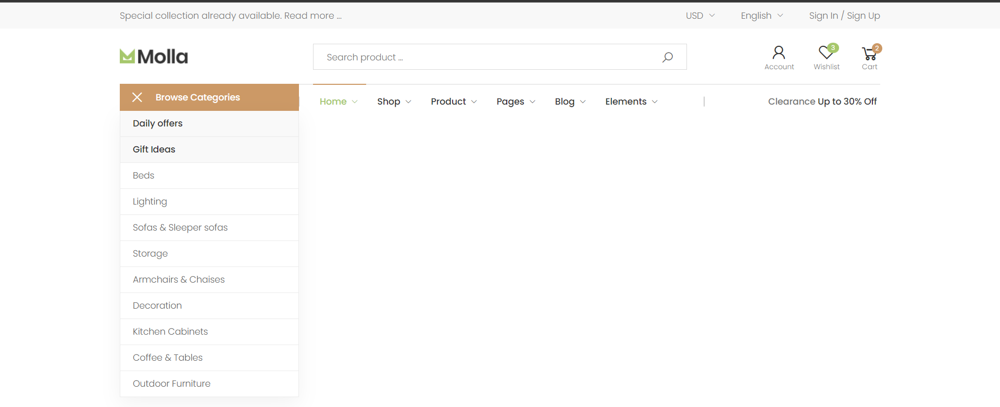
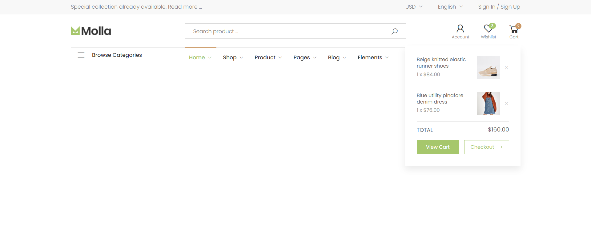
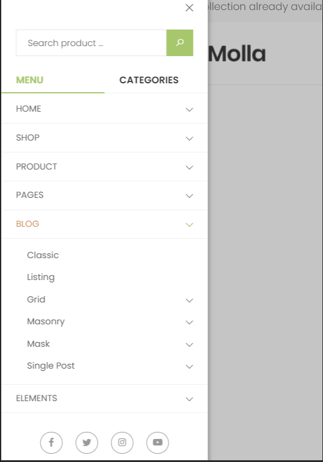
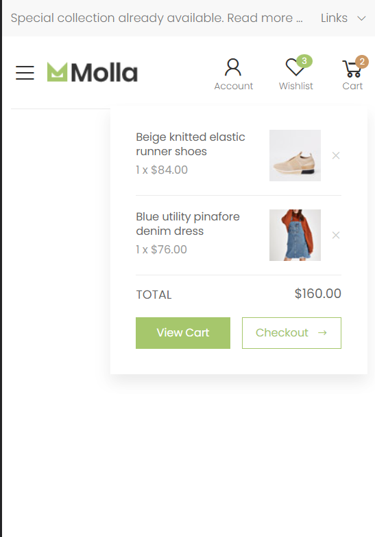

# Ecommerce Wep App

## Installation

This project was generated with [Angular CLI](https://github.com/angular/angular-cli) version 15.0.2.

Clone this repository

```bash
git clone https://github.com/baguilar6174/angular-ecommerce-app.git
```

Install dependencies

```bash
npm i
```

## Running the app

Run `ng serve` for a dev server. Navigate to `http://localhost:4200/`.

## My process

### Built with

- Angular 15
- Typescript
- Bootstrap 5
- SCSS

## Development Features

- Atomic design
- Eslint and Prettier
- Good folder structure

## TODO:

- Create more components
- Http request
- Interceptors
- Update README
- Documentation
- Internationalization

## Ecommerce Wep App

<table>
  <thead>
    <tr>
      <th colspan="2" style="text-align:center">Header</th>
    </tr>
  </thead>
  <tr>
    <td align="center" valign="center"></td>
    <td align="center" valign="center"></td>
  </tr>
  <tr>
    <td align="center" valign="center"></td>
    <td align="center" valign="center"></td>
  </tr>
</table>

## Stay in touch

- Website - [www.bryan-aguilar.com](https://www.bryan-aguilar.com/)
- Medium - [baguilar6174](https://baguilar6174.medium.com/)
- LinkeIn - [baguilar6174](https://www.linkedin.com/in/baguilar6174)
